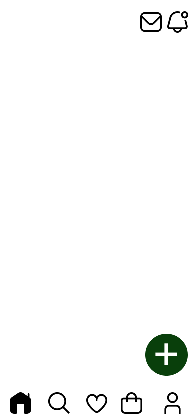
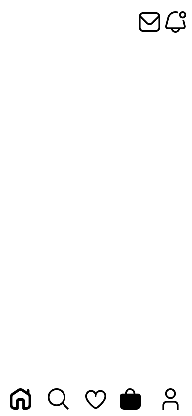
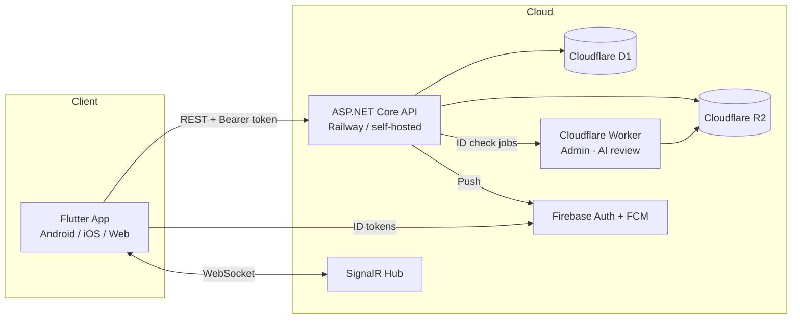

# UniMarket 🛍️

**A campus-only marketplace for students and staff** — discover, buy, and sell within your university community.

UniMarket is a contact-first marketplace built for campus life. Students browse listings nearby, filter by category, message sellers directly (with the listing attached to the chat), and arrange their own meetup and payment. Sellers apply for selling privileges, build a reputation, and can earn a **Verified Seller** badge based on measurable trust criteria.

> **Contact-first by design:** the MVP intentionally has no cart or in-app checkout. Buyers and sellers agree on payment and meetup directly — UniMarket provides discovery, trust, and communication.

---

## ✨ Highlights

- 🔐 **Firebase Authentication** (Email/Password + Google) for secure campus-only identity
- 🏫 **Campus-focused marketplace** with university data built in
- 👤 **Two-tier seller system** — apply to sell, then earn a *Verified Seller* badge
- 🏷️ **21 marketplace categories** with dynamic, per-category attribute schemas
- 🔎 **Tag- and attribute-aware search** across listings and feeds
- 📍 **Location-aware feeds** with "near you" distance labels
- 💬 **Real-time listing-aware chat** via SignalR
- ⭐ **Seller ratings, reviews, and reputation**
- 🛡️ **Listing reporting & moderation**
- 🖼️ **Cloudflare R2 image storage** with server-side resizing via an image proxy
- 🗄️ **Cloudflare D1** as the production database
- ⚡ **ASP.NET Core REST API** (stateless, deploy anywhere)
- 🤖 **AI-assisted seller verification** (Cloudflare Workers + Llama Vision)
- 🔔 **Firebase Cloud Messaging** push notifications

---

## 🧰 Tech Stack

| Layer            | Technology |
|------------------|------------|
| Mobile / Web app | **Flutter / Dart** (Material 3, Poppins, Lucide icons) |
| Backend API      | **ASP.NET Core (.NET 8)**, C#, SignalR |
| Database         | **Cloudflare D1** (SQLite at the edge) · local SQLite for dev |
| Object storage   | **Cloudflare R2** (listing photos, student ID uploads) |
| Auth             | **Firebase Authentication** (Email/Password + Google) |
| Real-time        | **SignalR** chat hub |
| Push             | **Firebase Cloud Messaging** |
| Admin / AI review| **Cloudflare Workers** + Workers AI (Llama 3.2 Vision) |
| Deployment       | Railway (or any .NET host) for the API · Vercel for web · Cloudflare Tunnel option |

---

## 📄 Table of Contents

- [Features](#-features)
- [Screenshots](#-screenshots)
- [System Architecture](#-system-architecture)
- [Repository Layout](#-repository-layout)
- [Getting Started](#-getting-started)
- [Environment Variables](#-environment-variables)
- [API Overview](#-api-overview)
- [Testing](#-testing)
- [Deployment](#-deployment)
- [Roadmap](#-roadmap)
- [Contributing](#-contributing)
- [Security](#-security)
- [License](#-license)
- [Author](#-author)
---

## ✨ Features

### 🛒 Contact-First Marketplace

- Browse listings from students and staff around your campus
- Search by category, tags, and structured attributes
- View seller profiles, ratings, and reviews before contacting
- Message sellers with the **listing automatically attached** to the thread
- Call sellers or arrange a meetup directly
- Wishlist to save deals

### 👤 Two-Tier Seller System
UniMarket separates *permission to sell* from *seller trust*.

**Tier 1 — Seller:** authenticated campus users apply with their campus email and student ID. An administrator approves the application.

**Tier 2 — Verified Seller:** a badge earned automatically by meeting defined trust criteria — or by admin review of a verification request.

| Requirement     | Threshold   |
|-----------------|-------------|
| Active listings | ≥ 3         |
| Completed sales | ≥ 2         |
| Average rating  | ≥ 4.5       |
| Time as seller  | ≥ 14 days   |
| Student ID      | Required    |

### 🏷️ Marketplace Categories

21 categories with fully dynamic posting schemas:

1. Electronics & Gadgets
2. Phones & Tablets
3. Computers & Accessories
4. Fashion & Clothing
5. Shoes & Bags
6. Beauty & Personal Care
7. Books & Stationery
8. Courses & Notes
9. Food & Snacks
10. Hostel & Room Essentials
11. Furniture
12. Sports & Fitness
13. Services & Gigs
14. Tickets & Events
15. Transportation
16. Health & Wellness
17. Art & Crafts
18. Baby & Kids
19. Pets & Supplies
20. Jobs & Internships
21. Other

Each category defines its own required/optional attributes, suggested tags, condition options, price labels, and description guides — e.g. *Phones & Tablets* requires **Brand, Model, Storage, Battery Health, Network Status**, while *Services & Gigs* requires **Service Type, Turnaround Time, Deliverables, Revisions**.

### 💬 Real-Time Messaging

- SignalR-backed chat with online presence, read state, and unread badges
- Listing-context cards attached to chat threads
- Sale-confirmation bubbles ("Confirm your purchase" in-thread)

### 🤖 AI-Assisted Seller Verification

On application, the backend queues a Cloudflare Worker job that:

1. Fetches the uploaded student-ID image through the admin API
2. Runs **Llama 3.2 Vision** to check the document (name + school visible)
3. Compares profile university and email domain against the ID + campus rules
4. Auto-approves on a high-confidence match, auto-rejects on a clear non-ID, otherwise leaves the request **Pending** for manual review
5. A per-minute cron sweep catches anything left behind
---

## 🖼️ Screenshots

Design reference captures live in [`figma_screenshot/`](./figma_screenshot).

| Home | Cart | Search |
|------|------|--------|
|  |  |  |

| Profile | Sign in | Onboarding |
|---------|---------|------------|
|  |  |  |

---

## 🏗️ System Architecture



**Overview:** the Flutter app calls the ASP.NET Core API with Firebase ID-token auth. The API is stateless — durable records live in **Cloudflare D1**, uploads in **Cloudflare R2**, and real-time chat runs over a **SignalR** hub. A **Cloudflare Worker** hosts the admin dashboard and the AI-assisted seller-ID review.

---

## 🗂️ Repository Layout

```
unimarket/
├── lib/                    # Flutter app (features + core design system)
│   ├── app.dart            # App root, scopes, routes
│   ├── core/               # theme, models, stores, constants, widgets, navigation
│   ├── features/           # auth, onboarding, shell, home, listings, search,
│   │                        # sell, seller, profile, messages, notifications ...
│   └── routes/             # Named routes
├── backend/                # ASP.NET Core API
│   ├── UniMarket.Api/      # Controllers, hubs, services, Dockerfile
│   └── deploy/             # Linux/Windows service + cloudflared tunnel scripts
├── cloudflare/
│   ├── admin-worker/       # Admin dashboard + AI review Worker
│   └── d1/                 # D1 schema (SQL)
├── tool/                   # Dev scripts
├── assets/                 # App images, icons, SVG
├── figma_screenshot/       # Design references
├── md/                     # Design & research docs
├── test/                   # Flutter widget tests
└── web/                    # Flutter web bootstrap + SEO
```
---

## 🚀 Getting Started

### Prerequisites

| Tool | Version |
|------|---------|
| [Flutter](https://docs.flutter.dev/get-started/install) | 3.x (Dart SDK `^3.11.0`) |
| [.NET SDK](https://dotnet.microsoft.com/download) | 8.0+ |
| [Node.js](https://nodejs.org) | 20+ (only for the Cloudflare Worker) |
| Firebase account | For auth + push |
| Cloudflare account | For D1 / R2 / Worker (optional in local dev) |

### 1. Clone

```bash
git clone https://github.com/Bosiakoba/UniMarket.git
cd unimarket
```

### 2. Run the API locally

```bash
cd backend/UniMarket.Api
dotnet restore
dotnet run
```

- API listens on `http://0.0.0.0:5080` (LAN-accessible on the same Wi-Fi).
- Open **Swagger UI** at `http://localhost:5080/swagger`.
- Readiness check: `GET /health` (reports `integrations.*` status, never secrets).

**Dev auth (no Firebase needed):** with `Firebase__Enabled=false`, hit protected routes with:

```http
X-Dev-User-Id: alex-demo
```

or call `POST /api/auth/session` with `{ "devUserId": "alex-demo" }`.

**Local-only data:** when `Cloudflare__D1Enabled=false`, data persists to `backend/UniMarket.Api/data/unimarket.db` and uploads fall back to `data/uploads/` (served at `/media`). See [`backend/README.md`](./backend/README.md) for full details.

### 3. Run the Flutter app

```bash
cd ../..
flutter pub get
flutter run
```

The app defaults to the production API URL in `lib/core/config/api_config.dart`. To point at your local API:

```bash
flutter run --dart-define=API_BASE_URL=http://localhost:5080
```

> `lib/firebase_options.dart` is generated locally — never commit it. Copy `lib/firebase_options.example.dart`, create a Firebase project, and regenerate platform configs with `flutterfire configure`.

### 4. Configure Firebase (optional for local UI)

1. Create a project at [Firebase Console](https://console.firebase.google.com).
2. Enable **Email/Password** and **Google** sign-in providers.
3. Create demo users: `alex.morgan@university.edu` (maps to seeded seller `alex-demo`) and `jordan@university.edu` (maps to `seller-jordan`).
4. Add your platform config files (`google-services.json` / `GoogleService-Info.plist` — see the `*.example` templates).
5. Run `flutterfire configure` to generate `lib/firebase_options.dart`.
---

## 🔧 Environment Variables

### Flutter app

Passed at build/run time with `--dart-define-from-file=.env` (see `.env.example`):

| Variable | Description |
|----------|-------------|
| `API_BASE_URL` | API base URL override (defaults to the production URL in `api_config.dart`) |

### Backend API

Copy `backend/UniMarket.Api/.env.example` → `.env` and fill in values. ASP.NET Core maps double-underscores to config sections (`Cloudflare__AccountId` → `Cloudflare:AccountId`):

| Variable | Purpose |
|----------|---------|
| `Api__PublicBaseUrl` | Public base URL used for R2 upload links / webhooks |
| `ConnectionStrings__Default` | Local SQLite path (dev only, `data/unimarket.db`) |
| `GOOGLE_APPLICATION_CREDENTIALS` | Path to the Firebase service-account JSON (git-ignored) |
| `Firebase__ProjectId` | Firebase project ID |
| `Firebase__Enabled` | `true` to verify Firebase ID tokens |
| `Cloudflare__AccountId` | Cloudflare account ID |
| `Cloudflare__D1DatabaseId` | D1 database UUID |
| `Cloudflare__D1ApiToken` | D1 API token (read/write) |
| `Cloudflare__D1Enabled` | `true` to use D1 as the production data store |
| `Cloudflare__R2AccessKeyId` / `Cloudflare__R2SecretAccessKey` | R2 credentials |
| `Cloudflare__R2BucketName` | R2 bucket (`unimarket-assets`) |
| `Cloudflare__R2Endpoint` | `https://<account_id>.r2.cloudflarestorage.com` |
| `Cloudflare__R2PublicBaseUrl` | Public R2 bucket URL (`pub-xxx.r2.dev`) |
| `Cloudflare__R2Enabled` | `true` to use R2 for uploads |
| `Cloudflare__AllowLocalUploadFallback` | Dev-only: save uploads to `data/uploads/` |
| `Admin__ApiKey` | Secret for the `X-Admin-Key` header on `/api/admin/*` routes |
| `Cloudflare__AiReviewUrl` | Admin-worker AI review endpoint |
| `Resend__ApiKey` / `Resend__FromAddress` / `Resend__Enabled` | Campus-email OTP sending for seller applications |

> **Never commit real keys.** Any `.env`-style file is git-ignored. Use the `*.example` templates in the repo instead.

---
## 🔌 API Overview

REST API under `/api`, JSON over HTTP, bearer-token auth (or `X-Dev-User-Id` in dev). Swagger is available at `/swagger` when running locally.

| Area | Routes |
|------|--------|
| Auth | `POST /api/auth/session` (Firebase token exchange) |
| Users | profile, seller application, verify-badge request |
| Listings | CRUD, catalog with seller data, photos |
| Sales | `POST /api/sales/record`, sale confirmations |
| Feed | `GET /api/feed` — curated campus feed sections |
| Wishlist | `GET/POST/DELETE /api/wishlist/:listingId` |
| Reviews | listing + seller reviews |
| Reports | report a listing, list my reports |
| Messages / Chat | REST thread endpoints + **SignalR** hub for real-time chat |
| Uploads / Media | images & documents (R2 or local fallback) |
| Image proxy | resized image delivery for low-bandwidth loads |
| Notifications | push + in-app inbox |
| Admin | `/api/admin/*` (guarded by `X-Admin-Key`) |

See `backend/UniMarket.Api/Controllers/` (and `Hubs/ChatHub.cs`) for the full surface.

---

## 🧪 Testing

```bash
# Flutter widget tests
flutter test

# Backend tests
cd backend/UniMarket.Api
dotnet test
```

The repo ships a Flutter widget smoke test (`test/widget_test.dart`). PRs that add meaningful tests are very welcome.

---

## 🚢 Deployment

### API — Railway (or any .NET 8 host)

1. Push `backend/UniMarket.Api` to Railway (a `Dockerfile` and `railway.json` are included).
2. Set the same `Firebase__*`, `Cloudflare__*`, `Admin__*`, `Resend__*` env vars listed above.
3. Railway runs the API with `ASPNETCORE_URLS=http://0.0.0.0:8080`.

### API — home server + Cloudflare Tunnel

`backend/deploy/` ships `install-linux-service.sh` / `install-windows-service.ps1` plus a `cloudflared.service` to expose a local `:5080` API through a public tunnel.

### Flutter web (Vercel)

The web app deploys as static files (Vercel has no Flutter runtime):

```bash
flutter build web --release
git add build/web            # vercel.json already points at build/web
git push
```

`vercel.json` handles SPA rewrites, security headers, and immutable caching. See [`WEB_DEPLOYMENT.md`](./WEB_DEPLOYMENT.md).

### Admin worker

```bash
cd cloudflare/admin-worker
npm install
wrangler secret put ADMIN_API_KEY   # same value as Admin__ApiKey on the API
npx wrangler deploy
```

Update `UNIMARKET_API_URL` in `cloudflare/admin-worker/wrangler.toml`. See [`cloudflare/admin-worker/README.md`](./cloudflare/admin-worker/README.md).

---

## 🗺️ Roadmap

- [x] Campus feed with sections & 2-column grid
- [x] Listing detail + photo carousel + reviews
- [x] Two-tier seller onboarding + verification
- [x] Real-time chat (SignalR) with listing context
- [x] Wishlist, notifications, reporting
- [x] Firebase Auth + Google sign-in + push
- [x] Production backend (D1 + R2 + Worker)
- [ ] In-app escrow & checkout
- [ ] Digital wallet / payouts
- [ ] Multi-campus scoping & border-router filtering
- [ ] Web/iOS release automation

---

## 🤝 Contributing

Contributions are welcome and appreciated! Please:

1. Fork the repo and create a branch (`feat/...`, `fix/...`).
2. Keep the [architecture conventions](./lib/ARCHITECTURE.md) — UI stays in `features/`, shared contracts in `core/`, no navigation from stores.
3. Follow the existing design tokens (`lib/core/theme/`, `lib/core/widgets/`).
4. Open a PR with a clear description; `flutter analyze` and `flutter test` should pass.
5. Flag design changes early — it's a small team, discussion is cheap.

---

## 🔒 Security

- Real secrets live only in `.env`/local configs — `.env*`, `google-services.json`, service-account files are git-ignored and **must** remain so.
- The API validates Firebase ID tokens on protected routes (when `Firebase__Enabled`).
- Admin routes require an `X-Admin-Key` secret.
- Uploads are normalized server-side (image proxy) to mitigate malicious payloads.
- Found a **security vulnerability**? Email the maintainer directly instead of opening a public issue.
---

## 📜 License

Distributed under the **MIT License**. See [`LICENSE`](./LICENSE) for more information.

---

## 👤 Author

**Raymond Antwi** — [@Bosiakoba](https://github.com/Bosiakoba)

Project: [github.com/Bosiakoba/UniMarket](https://github.com/Bosiakoba/UniMarket)

---

<p align="center">
  <sub>Built with 💚 for campus communities · Flutter · ASP.NET Core · Cloudflare</sub>
</p>