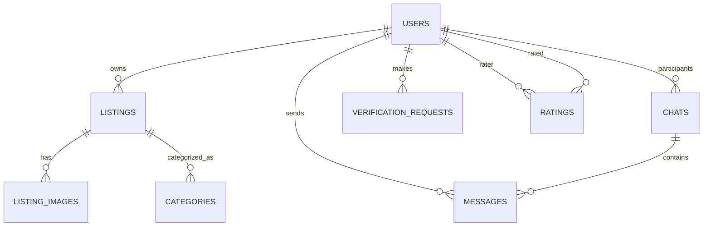
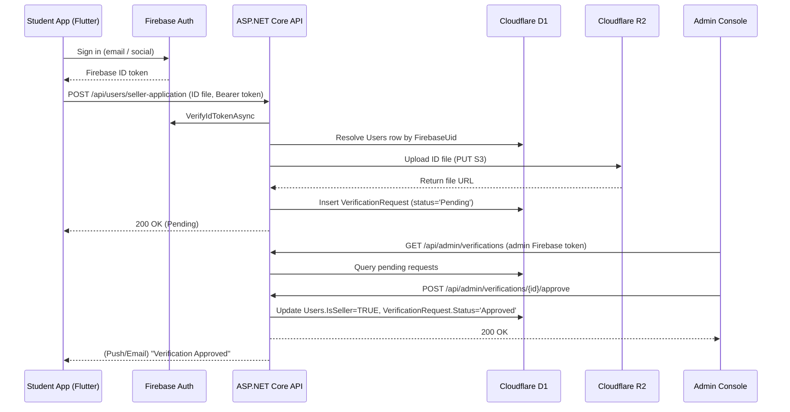

# Campus Market Hub – Technical Design Report

**Author:** [Your Name]  
**Date:** June 8, 2026  

---

## Executive Summary

The Campus Market Hub (CMH) is a *secure, campus-only marketplace* for students and staff. It enables campus users to browse listings, **contact sellers directly** (no in-app cart or checkout), and chat with listing context attached. Key requirements include a **two-tier seller model** (apply to sell vs. criteria-gated verified badge), **21 listing categories** with **tags** and **category-specific posting fields**, **geolocation-based feeds**, and **search ranking** that prioritizes verified sellers and matches tags/attributes. 

This report details a production-grade architecture using **Flutter** (mobile UI), **Firebase Authentication** (identity & sign-in), **ASP.NET Core (C#)** as the **main backend API**, **Cloudflare D1** (serverless SQLite database), and **Cloudflare R2** (S3-compatible object storage). Firebase handles user sign-up, login, and token issuance; the C# API validates Firebase ID tokens and owns all marketplace business logic (listings, chat, verification, search, admin). It covers system goals, deployment options, API design, security, data model (ER diagram, D1 schema), workflows (verification, chat), search & ranking, caching, scalability, CI/CD (Railway/Azure), monitoring, testing, performance, and cost analysis. 

All design choices follow best practices from official Cloudflare and Microsoft sources. The resulting system is modular, secure, and scalable, suitable for a final-year project or even a startup prototype.

---

## Table of Contents

- [Project Goals & Requirements](#project-goals--requirements)  
- [System Architecture](#system-architecture)  
  - [Deployment Options](#deployment-options)  
  - [Components Overview](#components-overview)  
  - [Firebase + C# + Cloudflare Data Flow](#firebase--c--cloudflare-data-flow)  
- [API Design](#api-design)  
  - [REST Endpoints & Methods](#rest-endpoints--methods)  
  - [Real-Time Chat (SignalR)](#real-time-chat-signalr)  
- [Security](#security)  
  - [Authentication (Firebase Auth + API Token Validation)](#authentication-firebase-auth--api-token-validation)  
  - [CORS and Env Vars](#cors-and-env-vars)  
  - [R2 Object URLs (Signed URLs)](#r2-object-urls-signed-urls)  
- [Data Model](#data-model)  
  - [ER Diagram](#er-diagram)  
  - [Cloudflare D1 Schema](#cloudflare-d1-schema)  
- [Trust & Verification Workflow](#trust--verification-workflow)  
- [Geolocation & Geofencing](#geolocation--geofencing)  
- [Search & Ranking Algorithm](#search--ranking-algorithm)  
- [Caching Strategy](#caching-strategy)  
- [Scalability & Failure Modes](#scalability--failure-modes)  
- [CI/CD & Deployment](#ci-cd--deployment)  
- [Monitoring & Logging](#monitoring--logging)  
- [Testing Strategy](#testing-strategy)  
- [Performance Optimization](#performance-optimization)  
- [Cost Considerations](#cost-considerations)  
- [Final Recommendations](#final-recommendations)  
- [Flutter UI Prototype (Current Implementation)](#flutter-ui-prototype-current-implementation)  
- [Listing Categories, Tags & Posting Schemas](#listing-categories-tags--posting-schemas)  
- [Appendix A: SQL Schema (Cloudflare D1)](#appendix-a-sql-schema-cloudflare-d1)
- [Appendix D: Category Posting Field Reference](#appendix-d-category-posting-field-reference)  
- [Appendix B: Environment Variables Example](#appendix-b-environment-variables-example)  
- [Appendix C: CI/CD Pipeline (GitHub Actions)](#appendix-c-cicd-pipeline-github-actions)  

---

## Project Goals & Requirements

- **Contact-first marketplace (no cart):** Buyers discover listings and **message or call the seller** to arrange meetup and payment off-platform. There is no shopping cart, checkout, or escrow in the MVP.  
- **Two-tier seller model:**
  - **Apply to sell:** Any authenticated campus user can submit a seller application (student ID on file) and begin posting once approved as a seller.
  - **Verified badge (criteria-gated):** A distinct **Verified Seller** badge is earned only after meeting thresholds: **3+ active listings**, **2+ completed sales**, **4.5+ average rating**, **14+ days** as a seller, and **student ID on file**. Verified sellers’ listings are prioritized in search/feeds.
- **21 categories with tags & structured attributes:** Every listing belongs to one of 21 categories. Sellers must add **1–5 tags** (searchable). Each category defines **required/optional posting fields** (brand, size, course code, event date, etc.), **description checklists**, **photo tips**, and **pricing/condition labels** tailored to that category.
- **Geo-personalized Listings:** The app detects the user’s campus location (GPS) and shows *nearby campus listings*. Optionally, use geofencing to restrict content to campus boundaries. Distance-based filters ensure relevance.  
- **Search Ranking:** Listings are ranked so that **verified sellers appear first**. Keyword search matches **title, description, tags, and category attribute values**. Pagination and filters (price, category) are required.  

Other requirements: **Firebase-powered authentication** (email/password and social sign-in on mobile), secure API access via Firebase ID tokens, image uploads to R2, in-app messaging with **listing attachment** on contact, listing reviews/ratings, report listing, owner listing management (mark sold/active, delete, discounts), and an admin interface for oversight.

---

## System Architecture

### Deployment Options

We compare deployment approaches for the C# backend:

| Environment         | Cost         | Ease     | Scale & Availability               | Pros                                   | Cons                                |
|---------------------|--------------|----------|------------------------------------|----------------------------------------|-------------------------------------|
| **Local Dev Server** (Laptop) | Free (local) | Easy (no cloud setup) | *Not public*; only LAN. | Fast development & testing. No hosting cost. | Not accessible outside LAN. No auto-scaling. Not production-ready. |
| **Railway / Render / Fly.io** (Free tier) | Free/low | Easy (GitHub CI) | Moderate (limited by free-tier). | Simple Git-based deploy; TLS, no config. | Free tier may sleep (cold start). Throughput limits. |
| **Azure App Service** | Free tier or paid | Moderate (Cloud setup) | High (scalable, SLA) | Production-grade, integrates with Azure SQL if needed. | Setup complexity; potential cost beyond free tier. |
| **AWS/GCP** | Paid | Complex | High | Very scalable, mature tools. | More expensive, not needed for student project. |

**Recommendation:** Develop locally (with internet on) using laptop as backend and Cloudflare D1/R2. For final deployment, Railway (free or cheap) provides a publicly accessible URL without managing servers. Azure is an optional enterprise step (ASPNET on Azure App Service + Azure SQL), but Railway suffices for a student project.

### Components Overview

| Layer | Technology | Responsibility |
|-------|------------|----------------|
| **Mobile UI** | Flutter | Screens, posting wizard, chat UI, feeds; obtains Firebase ID tokens |
| **Identity** | **Firebase Authentication** | Sign-up, login, password reset, Google/Apple OAuth; issues short-lived ID tokens |
| **Main backend** | **ASP.NET Core (C#)** | Token validation, business rules, REST + SignalR, D1/R2 orchestration, admin |
| **Database** | **Cloudflare D1** | Users (profile), listings, chats, messages, verification, ratings |
| **Object storage** | **Cloudflare R2** | Listing photos, student ID uploads, optional chat attachments |

### Firebase + C# + Cloudflare Data Flow

*Figure: Architecture Overview*

```text
    ┌────────────┐     sign-in      ┌─────────────────────┐
    │ Flutter    │ ───────────────▶ │ Firebase Auth       │
    │ Mobile App │ ◀─ ID token ──── │ (Google / Email)    │
    └─────┬──────┘                  └─────────────────────┘
          │
          │  HTTPS (Authorization: Bearer <Firebase ID token>)
          ▼
    ┌────────────────┐     SQL/API      ┌──────────────────┐
    │ ASP.NET Core   │ ───────────────▶ │ Cloudflare D1    │
    │ Web API (C#)   │                  │ (SQLite DB)      │
    └───────┬────────┘                  └──────────────────┘
            │
         (S3 API)
            ▼
    ┌──────────────────┐
    │ Cloudflare R2    │
    │ (Object Storage) │
    └──────────────────┘
```

**Division of responsibility:**

- **Firebase Auth** — *who* the user is. Flutter calls Firebase SDK for register/login; Firebase returns an ID token (JWT). No passwords are stored in D1 or handled by the C# API.
- **ASP.NET Core API** — *what* the user can do in the marketplace. Every protected route validates the Firebase token (Firebase Admin SDK), resolves `FirebaseUid` → `Users` row in D1, then runs listing/chat/verification logic.
- **Cloudflare D1** — canonical app data. First API call after Firebase sign-in may **upsert** a `Users` profile row keyed by `FirebaseUid`.
- **Cloudflare R2** — binary assets. The API issues presigned upload URLs or streams uploads server-side; D1 stores only metadata URLs.

Cloudflare D1 offers global replication and SQLite compatibility; R2 provides egress-free S3 storage. Firebase Auth removes the need to build password hashing, refresh-token rotation, and OAuth flows in C#. The C# service remains the **single source of truth** for marketplace rules and data integrity.

**Recommendation (unchanged):** Develop locally with the C# API talking to D1/R2. Deploy the API to Railway (or Azure) for production. Configure Firebase project (Android/iOS apps + service account for the API).  

---

## API Design

### REST Endpoints & Methods

The API follows RESTful patterns. **Authentication is delegated to Firebase** on the client; protected routes expect `Authorization: Bearer <Firebase ID token>`. The C# API validates the token and loads the campus user profile from D1.

- **Auth (Firebase-first — no password endpoints on API):**
  - `POST /api/auth/session` – *(Optional bootstrap)* After Firebase sign-in on mobile, send ID token; API verifies token, **creates or loads** `Users` row by `FirebaseUid`, returns app profile + seller/verified flags.
  - `POST /api/auth/verify-token` – Health/debug: validate token and return claims (admin only in production).
  - *Client-side only:* Register, login, password reset, Google/Apple sign-in via **Firebase Auth SDK** in Flutter — not implemented as C# password endpoints.
- **Users:**
  - `GET /api/users/me` – Current user profile (from D1, keyed by Firebase UID).
  - `PUT /api/users/me` – Update profile (display name, campus email, avatar URL).
  - `POST /api/users/seller-application` – Apply to sell (student ID file → R2).
  - `POST /api/users/verify-badge` – Apply for verified seller badge (criteria check).
- **Listings:**
  - `GET /api/listings` – List/search all listings (filters: category, keyword, location).
  - `GET /api/listings/{id}` – Get listing detail.
  - `POST /api/listings` – Create new listing (seller auth required). Body: `title`, `description`, `price`, `category`, `condition`, `meetupLocation`, `tags[]`, `attributes{}` (category-specific), `status`. Images via multi-part or `/api/listings/{id}/images`.
  - `PUT /api/listings/{id}` – Edit listing (owner only).
  - `DELETE /api/listings/{id}` – Delete listing (owner).
- **Chats:**
  - `GET /api/chats` – List user’s chat rooms.
  - `POST /api/chats` – Create or open chat (with listing/seller).
  - `POST /api/chats/{id}/messages` – Send message to chat (or use SignalR).
- **Admin:**
  - `GET /api/admin/verifications` – List pending ID verifications.
  - `POST /api/admin/verifications/{reqId}/approve` – Approve user verification.
  - `POST /api/admin/verifications/{reqId}/reject` – Reject request (with reason).
  - `GET /api/admin/users` – List/manage users.
  - *...additional admin endpoints (e.g., listing takedown)*.

All endpoints return standard HTTP status codes (200, 201, 400, 401, 403, etc.) with JSON bodies. DTOs (Data Transfer Objects) are used for request/response payloads, with data annotations for validation.

### Real-Time Chat (SignalR)

For in-app chat, we use **SignalR** (WebSockets). The workflow:

- The Flutter app connects to `/chatHub` with the **Firebase ID token** in the `Authorization` header (or `access_token` query on connect).
- SignalR Hub authenticates via custom middleware that validates Firebase tokens (Firebase Admin SDK) — same identity as REST.
- Client invokes `SendMessage(chatId, content)`.
- Server hub method saves message to D1 and broadcasts to others in that chat room.
- Other clients receive the message in real-time.

This meets requirement for instant messaging. Alternative: Polling via REST, but SignalR is more “production-grade” for real-time. 

---

## Security

### Authentication (Firebase Auth + API Token Validation)

**Firebase Authentication (client):**

- Flutter integrates `firebase_auth` for email/password and social providers (Google, Apple).
- Firebase manages credentials, MFA (future), password reset emails, and token refresh on device.
- Campus policy: restrict registration to **verified campus email domains** via Firebase Auth blocking functions or post-sign-in check in the API (`POST /api/auth/session` rejects non-campus emails).

**ASP.NET Core API (server):**

- Use **Firebase Admin SDK for .NET** to verify ID tokens on every protected request.
- Middleware flow: extract Bearer token → `FirebaseAuth.DefaultInstance.VerifyIdTokenAsync(token)` → read `uid`, `email` claims → map to `Users.FirebaseUid` in D1.
- **No `PasswordHash` in D1** — passwords never touch the C# API or SQLite.
- **App authorization** (seller, verified badge, admin) lives in D1 columns (`IsSeller`, `IsVerified`, `Role`), not in Firebase custom claims alone — keeps business rules in the main backend.
- Optional: sync `Role=Admin` to Firebase custom claims for defense in depth; D1 remains authoritative for seller/verified state.

**Token lifecycle:**

| Step | Actor | Action |
|------|-------|--------|
| 1 | Flutter | User signs in via Firebase SDK |
| 2 | Flutter | `getIdToken()` attached to API/SignalR calls |
| 3 | C# API | Verify token signature, expiry, audience |
| 4 | C# API | Load/create user in D1; enforce campus + seller rules |
| 5 | Flutter | Firebase SDK auto-refreshes token; no custom refresh table |

**Rejected requests:** Missing, expired, or tampered tokens → `401 Unauthorized`. Valid token but insufficient seller/admin rights → `403 Forbidden`.

### CORS and Environment Variables

- **CORS:** Enable CORS only for the Flutter app’s origins or allow any origin if under control. In `Startup`: 
  ```csharp
  services.AddCors(opts => opts.AddPolicy("AllowAll",
    b => b.AllowAnyHeader().AllowAnyMethod().AllowAnyOrigin()));
  ```
  (In production, restrict origin to your domain).  
- **Env Vars:** All secrets (Firebase service account JSON path or `GOOGLE_APPLICATION_CREDENTIALS`, D1 credentials, R2 keys, etc.) come from environment variables or encrypted config. Do **not** hardcode in source. Flutter uses `google-services.json` / `GoogleService-Info.plist` (non-secret project config; still not committed if policy requires).
- **HTTPS:** Always serve API over TLS. Railway and Azure auto-provision certificates for you.

### R2 Object URLs (Signed URLs)

If listing images should be private, the API can generate **signed URLs** for R2 objects. Using AWS SDK (`GetPreSignedURL`), issue a time-limited URL for uploads or downloads. For public images, simply store the R2 public link. Consider using **Bucket Scoped Tokens** or signed URLs for finer access control.

---

## Data Model

### ER Diagram



- **Users:** Students and admins. Key fields: `Id`, `FirebaseUid` (unique, from Firebase Auth), `FullName`, `Email`, `Role` (Student/Admin), `IsSeller`, `IsVerified`, `AvatarUrl`, etc. **No password column** — identity is Firebase-managed.
- **Listings:** Items/services. Fields: `Id`, `Title`, `Description`, `Price`, `Category`, `Condition`, `MeetupLocation`, `Status` (`active`/`sold`), `Tags` (JSON array), `Attributes` (JSON object — category-specific key/value pairs), `Location` (lat/lng), `UserId` (owner), etc.
- **Chats:** One per transaction (buyer-seller). Fields: `Id`, `ListingId`, `BuyerId`, `SellerId`.
- **Messages:** `Id`, `ChatId`, `SenderId`, `Content`, `Timestamp`.
- **ListingImages:** `Id`, `ListingId`, `ImageUrl` (R2 link).
- **Ratings:** Peer ratings (stars 1–5) for users: `RaterId`, `RatedId`, `Score`.
- **VerificationRequests:** `Id`, `UserId`, `Status` (Pending/Approved/Rejected), `SubmittedAt`, etc.

This normalized schema is SQLite (D1)-compatible. **Refresh tokens are not stored in D1** — Firebase handles session refresh on the client. All `Id` columns use GUIDs (TEXT) for uniqueness. Indexes on `Email`, `ListingId`, etc. would optimize queries. 

### Cloudflare D1 Schema (SQL)

The following is a condensed DDL suitable for Cloudflare D1 (SQLite). See Appendix A for full script.

```sql
CREATE TABLE Users (
    Id TEXT PRIMARY KEY,
    FirebaseUid TEXT UNIQUE NOT NULL,  -- Firebase Auth UID
    FullName TEXT NOT NULL,
    Email TEXT UNIQUE NOT NULL,
    Role TEXT NOT NULL DEFAULT 'Student', -- 'Student', 'Admin'
    IsSeller BOOLEAN DEFAULT FALSE,
    IsVerified BOOLEAN DEFAULT FALSE,
    AvatarUrl TEXT,
    CreatedAt DATETIME DEFAULT CURRENT_TIMESTAMP
);

CREATE TABLE Listings (
    Id TEXT PRIMARY KEY,
    UserId TEXT NOT NULL REFERENCES Users(Id),
    Title TEXT NOT NULL,
    Description TEXT,
    Price REAL NOT NULL,
    Category TEXT NOT NULL,
    Condition TEXT,
    MeetupLocation TEXT,
    Status TEXT NOT NULL DEFAULT 'active', -- 'active' | 'sold'
    Tags TEXT,        -- JSON array, e.g. ["iphone","used"]
    Attributes TEXT,  -- JSON object, e.g. {"brand":"Apple","storage":"128GB"}
    Latitude REAL,
    Longitude REAL,
    CreatedAt DATETIME DEFAULT CURRENT_TIMESTAMP
);

CREATE TABLE ListingImages (
    Id TEXT PRIMARY KEY,
    ListingId TEXT NOT NULL REFERENCES Listings(Id),
    ImageUrl TEXT NOT NULL
);

CREATE TABLE Chats (
    Id TEXT PRIMARY KEY,
    ListingId TEXT NOT NULL REFERENCES Listings(Id),
    BuyerId TEXT NOT NULL REFERENCES Users(Id),
    SellerId TEXT NOT NULL REFERENCES Users(Id),
    CreatedAt DATETIME DEFAULT CURRENT_TIMESTAMP
);

CREATE TABLE Messages (
    Id TEXT PRIMARY KEY,
    ChatId TEXT NOT NULL REFERENCES Chats(Id),
    SenderId TEXT NOT NULL REFERENCES Users(Id),
    Content TEXT,
    SentAt DATETIME DEFAULT CURRENT_TIMESTAMP
);

CREATE TABLE VerificationRequests (
    Id TEXT PRIMARY KEY,
    UserId TEXT NOT NULL REFERENCES Users(Id),
    Status TEXT NOT NULL DEFAULT 'Pending', 
    SubmittedAt DATETIME DEFAULT CURRENT_TIMESTAMP,
    ProcessedAt DATETIME
);

CREATE TABLE Ratings (
    Id TEXT PRIMARY KEY,
    RaterId TEXT NOT NULL REFERENCES Users(Id),
    RatedId TEXT NOT NULL REFERENCES Users(Id),
    Score INTEGER CHECK(Score BETWEEN 1 AND 5),
    Comment TEXT,
    CreatedAt DATETIME DEFAULT CURRENT_TIMESTAMP
);

```

Each table uses TEXT for IDs (Cloudflare D1 supports UUID strings). Foreign keys enforce relationships. The schema aligns with EF Core or any ORM if used for dev, though in production D1 SQL API calls (or Cloudflare.NET SDK) execute raw SQL.

---

## Trust & Verification Workflow

CMH separates **permission to sell** from the **verified seller badge**.

### Tier 1 — Apply to sell

1. **Seller application:** User submits **Apply to sell** with campus email and student ID (photo/PDF) via `POST /api/users/seller-application`.
2. **Storage:** Backend saves ID to R2 and creates a `SellerApplication` / `VerificationRequest` with status `Pending`.
3. **Approval:** Admin approves → user `IsSeller = TRUE` and may post listings. Rejection stores a reason.
4. **Posting:** Unverified sellers can list immediately after approval; listings show seller name but **no verified badge** until Tier 2 criteria are met.

### Tier 2 — Verified badge (automatic + optional admin review)

The **Verified Seller** badge is granted when **all** criteria are satisfied (enforced in app via `VerificationCriteria`):

| Criterion | Threshold |
|-----------|-----------|
| Active listings posted | ≥ 3 |
| Completed sales | ≥ 2 |
| Average seller rating | ≥ 4.5 |
| Days as an active seller | ≥ 14 |
| Student ID on file | Yes |

Users who meet criteria can tap **Apply for verified badge**; backend re-checks metrics and sets `Users.IsVerified = TRUE`. Listings from verified sellers are boosted in search (see Search section).

### Trust beyond the badge

- **Listing reviews:** Buyers leave star ratings and text on individual listings.
- **Report listing:** Flag inappropriate or scam listings for admin review.
- **Trust score (future):** Composite metric from ratings, completed chats, and report history.

*Sequence Diagram (Verification Flow):*



This ensures only authenticated campus members become verified sellers. Administrators can also reject and optionally ban.

---

## Geolocation & Geofencing

- **Campus Boundary:** Implement geo-fencing to restrict listings to campus coordinates. Store campus boundary polygon or use a max radius (e.g., 5 km from campus center). Check user’s GPS on login; if outside, either block or show “No listings found” (depends on policy).
- **Location-based Feed:** When querying listings (`GET /listings?lat=...&lon=...&radius=...`), filter by distance. For SQLite (D1), we can approximate Haversine or use a bounding box filter for simplicity:
  ```sql
  SELECT *, 
    ( (latitude - @lat)*(latitude - @lat) + (longitude - @lon)*(longitude - @lon) ) AS dist
  FROM Listings
  WHERE dist < (@radius/@earthRadius)^2
  ORDER BY dist, CASE WHEN EXISTS(SELECT 1 FROM Users WHERE Users.Id=Listings.UserId AND IsVerified=1) THEN 0 ELSE 1 END;
  ```
  Or perform precise Haversine math via user-defined function if needed. **Indexing:** Index (Latitude, Longitude) for efficient bounding box queries.
- **Privacy:** Do not store raw user GPS continuously. Only use it per query.

Geolocation implementation could use formulas in C# if D1 doesn't support complex math. The key is filtering by distance threshold to campus and sort by proximity or popularity.

---

## Search & Ranking Algorithm

Search supports keyword, category, price filters, and sorts by recency and trust. The Flutter prototype matches queries against **title**, **description**, **tags**, and **attribute values** (e.g. searching "128GB" finds phone listings with that storage attribute).

The ranking order is: Verified Sellers first, then regular. SQL example:

```sql
SELECT L.*, U.IsVerified
FROM Listings L JOIN Users U ON U.Id = L.UserId
WHERE L.Status = 'active'
  AND (
    L.Title LIKE '%' || @keyword || '%'
    OR L.Description LIKE '%' || @keyword || '%'
    OR L.Tags LIKE '%' || @keyword || '%'       -- JSON text search (MVP)
    OR L.Attributes LIKE '%' || @keyword || '%' -- JSON text search (MVP)
  )
  AND (@category IS NULL OR L.Category = @category)
  AND /* optional distance filter as above */
ORDER BY (CASE WHEN U.IsVerified=1 THEN 0 ELSE 1 END), L.CreatedAt DESC
LIMIT @limit OFFSET @offset;
```

This orders all verified-seller listings first. Pagination (LIMIT/OFFSET) handles infinite scroll. 

For production, parse `Tags`/`Attributes` JSON in application code or add generated columns / FTS5 for better performance. For MVP, SQLite `LIKE` on serialized JSON suffices.

---

## Caching Strategy

- **In-Memory Cache (Backend):** Use an in-memory LRU cache (e.g., `MemoryCache`) for frequent lookups: user profiles, trending categories. In .NET, this can significantly reduce D1 queries under load.
- **Redis (Optional):** If hosted on Azure, we could use Azure Redis Cache for session storage or caching search results. On Railway without Redis, rely on in-memory or Cloudflare Workers KV (advanced).
- **HTTP Caching:** API responses (like listing images) use Cache-Control headers. Cloudflare R2 and CDN naturally serve images quickly.

Given project scale, start without Redis; add if latency becomes an issue.

---

## Scalability & Failure Modes

- **Stateless API:** The ASP.NET Core service is stateless; scaling out is simple (multiple instances). Railway/Azure can auto-scale web dynos. 
- **Database (D1):** Cloudflare D1 automatically shards and replicates reads globally. Write throughput has limits; on heavy load, consider sharding by campus ID or using multiple D1 instances. 
- **Object Storage (R2):** Scales virtually unlimited with no egress fees. Ensure you handle  R2 eventual consistency by checking upload success.
- **Failure Recovery:** D1 offers time-travel backups (point-in-time). Configure routine backups to R2 for disaster recovery. R2 durability is SLA-backed.
- **Retry Logic:** Implement retries with exponential backoff on D1 or R2 timeouts (they are edge services). Cloudflare Workers/R2 generally have high availability.

**Risk:** Using D1 from outside Cloudflare (via Workers) adds latency. In practice, calls will still be fast (ms) but slower than local DB. If this becomes an issue, cache aggressively or consider migrating to a conventional DB (e.g., Azure SQL, PostgreSQL) in the future.

---

## CI/CD & Deployment

Use **GitHub Actions** to build, test, and deploy:

1. **CI**: On push to `main`, run `dotnet test` (unit tests) and Flutter analyzer/tests.
2. **Build:** Publish ASP.NET project (release). Docker optional on Railway.
3. **Deploy to Railway:**
   - Configure Railway to auto-deploy from GitHub.
   - Set Railway environment variables (API URL, Firebase service account, D1 credentials, R2 keys).
   - Railway provides a host (e.g. `https://cmh-api.railway.app`).  
   - Use *Railway Secrets* for Firebase credentials, Cloudflare tokens, and R2 keys.
   - Ensure `ASPNETCORE_ENVIRONMENT=Production`.
4. **(Optional Azure)**:
   - Use Azure DevOps or GitHub to deploy to Azure App Service similarly.
   - Use Azure Key Vault for secrets.
   - Configure slot deployments (staging/production).
   
*Example GitHub Actions snippet (see Appendix C)*:

```yaml
name: CI

on: [push]

jobs:
  build:
    runs-on: ubuntu-latest
    steps:
      - uses: actions/checkout@v5
      - name: Setup .NET
        uses: actions/setup-dotnet@v3
        with:
          dotnet-version: '10.0.x'
      - name: Restore and Build
        run: dotnet build --configuration Release
      - name: Test
        run: dotnet test --no-build
      - name: Deploy to Railway
        run: npx railway up --environment production
        env:
          RAILWAY_API_TOKEN: ${{ secrets.RAILWAY_TOKEN }}
```

Configure environment-specific settings in `appsettings.{Development|Production}.json` and override via env vars.

---

## Monitoring & Logging

- **Application Logs:** Use structured logging (Serilog or Microsoft.Extensions.Logging) writing to console or a file. Railway logs can be viewed in its dashboard. Capture WARN/ERROR levels. 
- **Cloudflare Analytics:** Enable D1 query metrics and R2 usage metrics in Cloudflare Dashboard for insights (e.g. top queries, storage growth).
- **Error Tracking:** Integrate Sentry or Application Insights to catch uncaught exceptions.
- **Health Checks:** Implement an endpoint (`/health`) for uptime monitoring. Use Railway/Cloudflare synthetic monitors if available.
- **Usage Analytics:** Optionally, log important events (sign-ups, new listing) to a dashboard (e.g., via Azure Application Insights or simple logs).

---

## Testing Strategy

- **Unit Tests (Backend):** 
  - Test controllers and services with mocks (xUnit/NUnit). 
  - Use EF Core InMemory or SQLite in-memory for repository tests.
- **Integration Tests (Backend):**
  - Spin up a local D1 (if possible) or use test SQLite with the same schema.
  - Test API endpoints end-to-end (e.g., using `Microsoft.AspNetCore.TestHost`).
- **Flutter Tests:**
  - Widget tests for UI components.
  - Integration tests (with `flutter_driver` or `integration_test`) to simulate user flows. Mock API responses or point to a test backend.
- **E2E Tests:**
  - Automated UI tests (e.g., using Appium or Flutter integration).
  - Simulate Firebase sign-in → API session bootstrap, listing creation, and chat to catch full-flow issues.
- **Security Tests:**
  - Verify Firebase ID token validation (valid, expired, tampered, wrong-audience tokens).
  - Test campus-email rejection on `POST /api/auth/session` for non-allowed domains.
  - Check CORS restrictions and seller/admin authorization (`403` on protected routes).

CI should run at least unit and integration tests on each push, and manual QA can be done on a deployed staging instance.

---

## Performance Optimization

- **D1 Query Optimization:** Use prepared statements and indexes (e.g., `CREATE INDEX idx_listings_user ON Listings(UserId)`). Limit rows and fetch only needed columns.
- **Batch Inserts:** For actions with multiple inserts (e.g., seeding data), wrap in a transaction.
- **Async/Await:** Use asynchronous database and I/O calls to free threads.
- **SignalR Scaling:** For many chat users, consider scaling out with Redis backplane (SignalR scale-out). Without Redis, a single instance handles moderate load.
- **Flutter Client:** Use image caching (e.g., `cached_network_image` package). Minimize widget rebuilds with Provider/Bloc.
- **Lazy Loading:** Load listings and chat history in pages/chunks.

Load testing (e.g., Apache JMeter or k6) can simulate multiple users. Identify bottlenecks (likely D1 query throughput) and address (cache or DB sharding).

---

## Cost Considerations

- **Firebase Authentication:** Generous free tier (email/password and common OAuth providers) for campus-scale MAU. No custom auth server to host.
- **Cloudflare D1:** Free tier provides some storage/queries. Pricing based on queries and storage; expect low cost for <1M queries.
- **Cloudflare R2:** Free up to 10 GB & limited requests; egress-free for users.
- **Railway:** Free plan supports small apps with sleep. Upgrade plan (~$5-$10/mo) for 24/7 uptime.
- **Azure (optional):** Free credits and a free tier App Service. Database (Azure SQL or PostgreSQL) may incur cost beyond free.
- **Monitoring:** Use built-in Cloudflare analytics; Sentry free plan.
- **Storage:** If we use R2 extensively (images), consider cost if usage skyrockets. R2 cost is per GB stored and request; expected negligible for campus app.

Keep usage within free tiers initially. The proposed stack (D1/R2) is extremely cost-effective as Cloudflare imposes no egress fees and D1’s pricing is usage-based.

---

## Final Recommendations

- **Start Simple:** Wire **Firebase Auth** in Flutter first, then build the C# API with Firebase Admin token middleware and D1/R2. Bootstrap users via `POST /api/auth/session` after sign-in.  
- **Document Well:** For final-year submission, include architecture diagrams (as above), ER diagrams, sequence diagrams (see Appendix). Discuss choices (Firebase for identity, C# for marketplace logic, D1/R2 for data and assets).
- **Follow Best Practices:** Ensure clean code (SOLID, layered architecture), security (Firebase token verification, no passwords in API/D1), and provide API docs (Swagger).
- **Risk Mitigation:** Note the D1 latency caveat in your report and explain caching strategies.
- **Polish UI/UX:** Even with heavy backend, a well-designed Flutter UI will impress (loading indicators, error messages, smooth navigation).
- **Prepare Demo:** Have both local and deployed versions ready. Show off SignalR chat and geo-filtering live.

With this design, CMH will be seen as a **production-quality system**. It addresses real-world issues (security, scaling) and uses modern cloud tech as expected for top marks.

---

## Flutter UI Prototype (Current Implementation)

The Flutter app (`lib/`) implements the contact-first marketplace UX described above. Key screens and behaviors:

### Navigation shell

- **Bottom nav (5 items):** Home · Search · **+ (Post)** · Wishlist · Profile — centered **+** opens the sell flow (no cart tab).
- **Top bar:** Campus logo (`VaultTopBar`) instead of profile avatar on main feeds.

### Buyer flows

- **Home / Search:** Browse active listings; search matches title, description, tags, and attributes.
- **Listing detail:** Photos, price, description, **category attribute chips**, tags, seller info, reviews. Actions: **Contact seller** (opens chat with listing attached), **Call**, **Report listing**, write review.
- **Messaging:** Inbox + chat threads; contacting a seller pre-attaches the listing card.

### Seller flows

- **Sell entry routing:** Non-sellers → **Apply to sell**; sellers → **Post listing**; criteria met → **Verified seller** screen to apply for badge.
- **Post listing wizard (4 steps):**
  1. **Photos** — up to 4 images; shows **category photo tips** (updates when category changes on step 2).
  2. **Details** — category picker (21 options), **description guide card** (buyer-expectation checklist), title hint, **dynamic category fields**, description hint, **tags** (1–5 required, category-suggested).
  3. **Pricing & meetup** — price label/hint per category (e.g. "Starting price" for services), **condition chips** only when `showCondition` is true, meetup location.
  4. **Review** — summary including attributes before publish.
- **My listings:** Dedicated screen with stats and filters (not mixed into post flow).
- **Owner listing detail:** Mark sold / Mark active / Delete (replaces buyer contact actions).

### Source-of-truth files (mock data → API later)

The Flutter app currently uses in-memory stores and mocks. When the C# backend is live, repositories will call the API with Firebase ID tokens; see `lib/ARCHITECTURE.md`.

| Concern | Path |
|---------|------|
| Layering & backend integration plan | `lib/ARCHITECTURE.md` |
| 21 categories + suggested tags | `lib/core/constants/market_categories.dart` |
| Per-category posting schemas | `lib/core/constants/category_posting_schemas.dart` |
| Post / edit listing wizard | `lib/features/sell/post_listing_screen.dart`, `edit_listing_screen.dart` |
| Seller state & publish | `lib/core/data/stores/seller_store.dart` |
| Home feed sections (Hot deals, etc.) | `lib/core/data/services/home_feed_service.dart` |
| Repository contracts (API swap-in) | `lib/core/data/repositories/` |
| Mock seed data | `lib/core/data/mock/` |
| Verification thresholds | `lib/core/constants/verification_criteria.dart` |
| Messaging | `lib/core/data/stores/message_store.dart`, `lib/features/messages/` |
| Listings UI (detail, grid, actions) | `lib/features/listings/` |
| **Future auth** | `firebase_auth` + `POST /api/auth/session` on C# API (not wired in prototype yet) |

---

## Listing Categories, Tags & Posting Schemas

Every listing uses exactly one category from the table below. Tags are **required** (minimum 1, maximum 5) and power discovery. **Attributes** are structured fields defined per category; required fields block publish until filled.

### Posting wizard alignment

When the seller selects a category, the app loads `CategoryPostingSchemas.forCategory(category)` and updates:

| UI element | Schema property |
|------------|-----------------|
| Title placeholder | `titleHint` |
| Description placeholder | `descriptionHint` |
| Buyer checklist card | `descriptionChecklist` |
| Photo tips (step 1) | `photoTips` |
| Dynamic form fields | `fields[]` (`CategoryField`: text, number, dropdown) |
| Price label & hint | `priceLabel`, `priceHint` |
| Condition chips | `showCondition`, `conditionOptions` |
| Listing kind | `kind` — `product`, `service`, `food`, `ticket`, `job`, `other` |

Categories without physical condition (courses, food, services, tickets, jobs) set `showCondition: false`.

### All 21 categories (summary)

See **Appendix D** for the full field-level reference. Summary:

| Category | Kind | Required attributes (high level) | Condition shown |
|----------|------|----------------------------------|-----------------|
| Electronics & Gadgets | product | Brand, warranty | Yes (default) |
| Phones & Tablets | product | Brand, storage, battery health, network | Yes |
| Computers & Accessories | product | Brand, key specs | Yes |
| Fashion & Clothing | product | Size, fit/style | Custom options |
| Shoes & Bags | product | Size, item type | Custom options |
| Beauty & Personal Care | product | Product name, remaining, seal status | Custom options |
| Books & Stationery | product | Title/author, edition | Custom options |
| Courses & Notes | product | Course code, semester, format | No |
| Food & Snacks | food | Food type, quantity, freshness window | No |
| Hostel & Room Essentials | product | Item type | Yes |
| Furniture | product | Type, material, dimensions | Yes |
| Sports & Fitness | product | Sport/activity | Yes |
| Services & Gigs | service | Service type, turnaround, deliverables | No |
| Tickets & Events | ticket | Event name, date, venue, ticket type | No |
| Transportation | product | Type, mechanical condition | Yes |
| Health & Wellness | product | Product type | Custom options |
| Art & Crafts | product | Art type, medium, dimensions | Yes |
| Baby & Kids | product | Item type, age range | Yes |
| Pets & Supplies | product | Pet/supply type | Yes |
| Jobs & Internships | job | Role, pay type, schedule, location | No |
| Other | other | Item summary | Yes |

### API payload example

```json
{
  "title": "iPhone 13 128GB — 89% battery health",
  "description": "Face ID works. No cracks. iCloud removed.",
  "category": "Phones & Tablets",
  "price": 3200,
  "condition": "Like new",
  "meetupLocation": "Main Campus",
  "tags": ["iphone", "128gb", "unlocked"],
  "attributes": {
    "brand": "Apple",
    "model": "iPhone 13",
    "storage": "128GB",
    "battery_health": "89%",
    "network": "Unlocked"
  },
  "photoUrls": ["..."]
}
```

---

## Appendices

### Appendix A: SQL Schema (Cloudflare D1)

```sql
-- Schema for Cloudflare D1 (SQLite)
-- Identity: FirebaseUid links to Firebase Auth; no password storage in D1.
CREATE TABLE Users (
    Id TEXT PRIMARY KEY,
    FirebaseUid TEXT UNIQUE NOT NULL,
    FullName TEXT NOT NULL,
    Email TEXT UNIQUE NOT NULL,
    Role TEXT NOT NULL DEFAULT 'Student',
    IsSeller BOOLEAN DEFAULT FALSE,
    IsVerified BOOLEAN DEFAULT FALSE,
    AvatarUrl TEXT,
    CreatedAt DATETIME DEFAULT CURRENT_TIMESTAMP
);
CREATE TABLE Listings (
    Id TEXT PRIMARY KEY,
    UserId TEXT NOT NULL REFERENCES Users(Id),
    Title TEXT NOT NULL,
    Description TEXT,
    Price REAL NOT NULL,
    Category TEXT NOT NULL,
    Condition TEXT,
    MeetupLocation TEXT,
    Status TEXT NOT NULL DEFAULT 'active',
    Tags TEXT,
    Attributes TEXT,
    Latitude REAL,
    Longitude REAL,
    CreatedAt DATETIME DEFAULT CURRENT_TIMESTAMP
);
CREATE TABLE ListingImages (
    Id TEXT PRIMARY KEY,
    ListingId TEXT NOT NULL REFERENCES Listings(Id),
    ImageUrl TEXT NOT NULL
);
CREATE TABLE Chats (
    Id TEXT PRIMARY KEY,
    ListingId TEXT NOT NULL REFERENCES Listings(Id),
    BuyerId TEXT NOT NULL REFERENCES Users(Id),
    SellerId TEXT NOT NULL REFERENCES Users(Id),
    CreatedAt DATETIME DEFAULT CURRENT_TIMESTAMP
);
CREATE TABLE Messages (
    Id TEXT PRIMARY KEY,
    ChatId TEXT NOT NULL REFERENCES Chats(Id),
    SenderId TEXT NOT NULL REFERENCES Users(Id),
    Content TEXT,
    SentAt DATETIME DEFAULT CURRENT_TIMESTAMP
);
CREATE TABLE VerificationRequests (
    Id TEXT PRIMARY KEY,
    UserId TEXT NOT NULL REFERENCES Users(Id),
    Status TEXT NOT NULL DEFAULT 'Pending',
    SubmittedAt DATETIME DEFAULT CURRENT_TIMESTAMP,
    ProcessedAt DATETIME
);
CREATE TABLE Ratings (
    Id TEXT PRIMARY KEY,
    RaterId TEXT NOT NULL REFERENCES Users(Id),
    RatedId TEXT NOT NULL REFERENCES Users(Id),
    Score INTEGER CHECK(Score BETWEEN 1 AND 5),
    Comment TEXT,
    CreatedAt DATETIME DEFAULT CURRENT_TIMESTAMP
);
```

### Appendix B: Environment Variables Example

```plaintext
# ASP.NET Core (appsettings or Railway / Azure secrets)
Firebase:ProjectId = "<FIREBASE_PROJECT_ID>"
# Service account JSON path, or inline JSON in a secret manager:
GOOGLE_APPLICATION_CREDENTIALS = "/path/to/firebase-service-account.json"

Cloudflare:AccountId = "<CLOUDFLARE_ACCOUNT_ID>"
Cloudflare:D1DatabaseId = "<D1_DATABASE_ID>"
Cloudflare:ApiToken = "<CLOUDFLARE_API_TOKEN>"
Cloudflare:R2AccessKey = "<R2_ACCESS_KEY>"
Cloudflare:R2SecretKey = "<R2_SECRET_KEY>"
Cloudflare:R2Bucket = "campus-market-bucket"
Cloudflare:R2Endpoint = "https://<account_id>.r2.cloudflarestorage.com"

# Flutter (build-time / platform config — not C# secrets)
# google-services.json (Android), GoogleService-Info.plist (iOS)
```

**Note:** The C# API does **not** issue or store JWT signing keys for user login — Firebase Auth handles that. The API only verifies incoming Firebase ID tokens via the Admin SDK.

### Appendix C: CI/CD Pipeline (GitHub Actions YAML)

```yaml
name: CI-CD

on:
  push:
    branches: [ main ]

jobs:
  build:
    runs-on: ubuntu-latest
    steps:
      - uses: actions/checkout@v5

      - name: Setup .NET SDK
        uses: actions/setup-dotnet@v3
        with:
          dotnet-version: '10.x'

      - name: Restore and Build
        run: dotnet build --configuration Release

      - name: Run Tests
        run: dotnet test --no-build --configuration Release

      - name: Deploy to Railway
        env:
          RAILWAY_API_TOKEN: ${{ secrets.RAILWAY_TOKEN }}
        run: |
          npx railway up --yes --environment production
```

### Appendix D: Category Posting Field Reference

Mirrors `lib/core/constants/category_posting_schemas.dart`. Each row lists **required** fields; optional fields are noted in parentheses.

#### Electronics & Gadgets
- **Fields:** Brand*, Model, Warranty status*, Included accessories
- **Checklist:** Brand/model, usage duration, battery, accessories, defects, reason for selling
- **Photo tips:** Front/back, serial label, accessories, wear close-ups

#### Phones & Tablets
- **Fields:** Brand*, Model, Storage*, Battery health*, Network status*
- **Checklist:** Storage/color, battery %, biometrics, network lock, account removed, damage
- **Photo tips:** Screen on, battery screenshot, ports/corners, settings/IMEI if comfortable

#### Computers & Accessories
- **Fields:** Brand*, Model, Key specs*, OS version, Battery cycles/health
- **Checklist:** Full specs, OS, battery cycles, keyboard/screen, extras, faults

#### Fashion & Clothing
- **Fields:** Brand*, Size*, Fit/style (Men/Women/Unisex)*, Material
- **Condition options:** New with tags, Like new, Good, Fair

#### Shoes & Bags
- **Fields:** Brand*, Model, Size*, Item type (sneakers, bags, etc.)*
- **Condition options:** New with tags, Like new, Good, Fair

#### Beauty & Personal Care
- **Fields:** Brand*, Product name*, Remaining amount*, Seal status*
- **Condition options:** Sealed, Opened — like new, Opened — used

#### Books & Stationery
- **Fields:** Title/author*, Edition*, Course/level, ISBN
- **Condition options:** Like new, Light notes, Heavy notes, Worn cover

#### Courses & Notes (`showCondition: false`)
- **Fields:** Course code*, Semester/year*, Format*, Includes
- **Price label:** Price (GHS)

#### Food & Snacks (`showCondition: false`)
- **Fields:** Food type*, Quantity/serving*, Freshness window*, Allergens

#### Hostel & Room Essentials
- **Fields:** Item type*, Dimensions/capacity, Power/setup

#### Furniture
- **Fields:** Furniture type*, Material*, Dimensions*, Assembly state

#### Sports & Fitness
- **Fields:** Sport/activity*, Brand, Size/weight

#### Services & Gigs (`showCondition: false`)
- **Fields:** Service type*, Turnaround*, Deliverables*, Revisions included
- **Price label:** Starting price (GHS)

#### Tickets & Events (`showCondition: false`)
- **Fields:** Event name*, Event date*, Venue*, Ticket type*

#### Transportation
- **Fields:** Type (bicycle, carpool, etc.)*, Age/mileage, Mechanical condition*

#### Health & Wellness
- **Fields:** Product type*, Brand, Seal status
- **Condition options:** Sealed, Opened — unused, Opened — used

#### Art & Crafts
- **Fields:** Art type*, Medium*, Dimensions*, Handmade (Handmade/Print/Mixed)

#### Baby & Kids
- **Fields:** Item type*, Age range*, Brand

#### Pets & Supplies
- **Fields:** Pet/supply type*, Brand, Size/capacity

#### Jobs & Internships (`showCondition: false`)
- **Fields:** Role title*, Pay type*, Schedule*, Location (on campus/remote/etc.)*
- **Price label:** Pay / stipend (GHS)

#### Other
- **Fields:** Item summary*

`*` = required in the posting wizard before the seller can continue.

---

**Sources:** We followed [Firebase Authentication docs], [Firebase Admin SDK for .NET], [Cloudflare D1 docs], [Cloudflare R2 docs], and [ASP.NET Core security docs] to ensure best practices. This design also draws on community experiences and official guides to produce a robust, exam-ready solution.

